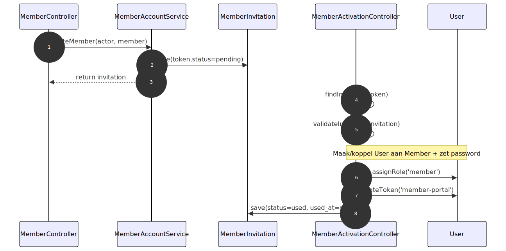

# Analyse- & Ontwerpdocument – Ledensysteem (Aidatim)

Datum: 2026-01-22  
Auteur: Imad Amazyan
Versie: 1.0

## 1. Inleiding

Dit document onderbouwt het ontwerp van het project **Ledensysteem (Aidatim)** voor de opdracht “Validering 1e leerjaar” (Avans Deeltijd Informatica).

Het systeem is een webapplicatie met:
- Een **database** met meerdere tabellen.
- **CRUD**-functionaliteit om gegevens te bekijken/onderhouden.
- **Inloggen** om onderhoudsfunctionaliteit te beveiligen.
- Minimaal één **veel-op-veel-relatie** (rollen ↔ gebruikers).

De applicatie is opgezet als **SPA frontend (React/TypeScript)** + **API backend (Laravel/PHP)** + **MySQL database**.

### Diagrammen (Mermaid)
De diagrammen zijn bewerkbaar als Mermaid-bronbestanden in `diagrams/*.mmd` en worden als SVG ingesloten in dit document (zodat ze in elke Markdown preview zichtbaar zijn).

## 2. Analyse

### 2.1 Context en scope

Het onderwerp is een **ledensysteem** voor organisaties (bijv. een club). Een organisatie kan gebruikers (beheerders/monitor) en leden beheren. Leden kunnen via een portaal hun gegevens bekijken en (optioneel) bijdragen betalen. Daarnaast is er platformbeheer voor het beheren van organisaties en abonnementen/plannen.

De applicatie ondersteunt meerdere organisaties via **subdomeinen** (multi-tenancy):
- `www`/hoofddomein: marketingpagina + organisatie registreren
- `portal`: platformbeheer
- `<organisatie-subdomein>`: organisatie-omgeving en ledenportaal

### 2.2 Stakeholders (gebruikersgroepen)
- **Bezoeker (niet ingelogd)**: kan een organisatie registreren en (optioneel) een lid aanmelden.
- **Platform admin**: beheert organisaties, plannen en platforminstellingen.
- **Organisatie admin (org_admin)**: beheert leden, organisatiegebruikers, bijdragen en abonnementen.
- **Monitor**: heeft beperkte toegang tot monitoring functionaliteit.
- **Lid (member)**: kan inloggen op het ledenportaal, profiel beheren en bijdragen/betalingen inzien.

### 2.3 Eisen en wensen (requirements)

#### Functionele eisen (minimaal)
F1. Gebruikers kunnen **inloggen** en uitloggen.  
F2. Alleen geauthenticeerde gebruikers krijgen toegang tot beheerschermen (auth + autorisatie).  
F3. Er is CRUD op meerdere tabellen, minimaal:
- Leden beheren (aanmaken, bekijken, wijzigen, (de)activeren / status)
- Organisatiegebruikers beheren (aanmaken, bekijken, blokkeren/deblokkeren, verwijderen)
- Plannen beheren (aanmaken, wijzigen, verwijderen) door platform admins  
F4. De database bevat minimaal één **veel-op-veel-relatie**.  
F5. Multi-tenant: data is gescheiden per organisatie (toegang alleen tot eigen organisatie).  

#### Wensen / uitbreidingen (zoals in deze codebasis)
W1. Leden kunnen via uitnodiging hun account activeren.  
W2. Ledenportaal voor self-service (profiel, bijdrage-informatie).  
W3. Importfunctie voor leden via Excel/CSV-template.  
W4. Abonnementen/betalingen via Stripe (SaaS/SEPA flow) + audit logging.  
W5. Monitorpagina die ook bij beperkte billing-status toegankelijk blijft.

### 2.4 Kwaliteitseigenschappen + validatiecriteria

Onderstaande kwaliteitscriteria geven aan **hoe** je aantoont dat de kwaliteit voldoende is (testcriteria/DoD).

**Beveiliging**
- K1: Alleen ingelogde gebruikers kunnen beheer-API routes aanroepen (auth middleware).  
  Validatie: probeer een beheer-endpoint zonder login → verwacht `401/403`.
- K2: Organisatie-afscherming: gebruiker kan nooit data van andere organisatie lezen/wijzigen.  
  Validatie: met gebruiker van organisatie A een request doen op subdomein B → verwacht `403`.
- K3: Wachtwoorden worden gehasht opgeslagen.  
  Validatie: controleer Laravel hashing / `password` cast + DB inhoud.

**Correctheid / data-integriteit**
- K4: Foreign keys en delete-regels zijn aanwezig voor kernrelaties.  
  Validatie: inspecteer DDL/migraties + test `ON DELETE` gedrag.

**Gebruiksvriendelijkheid**
- K5: Navigatie is logisch per rol; duidelijke foutmeldingen bij mislukte acties.  
  Validatie: handmatige walkthrough met 3 rollen (platform admin / org_admin / member).

**Onderhoudbaarheid**
- K6: Scheiding van verantwoordelijkheden (controllers/services/models; frontend routes/components).  
  Validatie: code review van lagen + herbruikbare services.

**Responsive webdesign**
- K7: UI werkt op mobiel/tablet/desktop (breakpoints).  
  Validatie: browser devtools responsive mode + CSS audit.

**Validatie HTML/CSS (opdracht-eis)**
- K8: HTML valideert via W3C validator; CSS via Jigsaw.  
  Validatie: screenshots/rapporten toevoegen aan oplevering (zie §8).

## 3. Functioneel ontwerp

### 3.1 Rollen en rechten (hoog niveau)
- **platform_admin**:
  - Organisaties beheren (CRUD/actie: activeren, blokkeren, verwijderen)
  - Plannen beheren (CRUD)
  - Platforminstellingen beheren (CRUD op settings)
- **org_admin**:
  - Organisatiegebruikers beheren (CRUD-lite: create/list/block/unblock/delete)
  - Leden beheren (CRUD + statuswijzigingen)
  - Leden uitnodigen / accounts blokkeren
  - Overzichten bijdragen, abonnementen beheren
- **monitor**:
  - Monitorpagina voor organisatie (read-only/overzicht)
- **member**:
  - Ledenportaal: dashboard, profiel, bijdrage-overzicht/betalen

### 3.2 Belangrijkste schermen (frontend)
Routes zijn rol-afhankelijk (indicatief):
- Publiek: marketing + organisatie registreren
- Auth:
  - `/login`, `/forgot-password`, `/reset-password`
- Organisatie admin:
  - `/organisation/dashboard`, `/organisation/users`, `/organisation/members`, `/organisation/members/import`
  - `/organisation/subscription`, `/organisation/settings/payments`, `/organisation/contributions`
- Platform admin:
  - `/platform/organisations`, `/platform/plans`, `/platform/settings`
- Member portal:
  - `/portal/login`, `/portal/dashboard`, `/portal/profile`, `/portal/contribution`

### 3.3 Business rules (kern)
- BR1: Een gebruiker hoort bij precies één organisatie (`users.organisation_id`) óf is platform admin.
- BR2: Een lid hoort bij precies één organisatie (`members.organisation_id`).
- BR3: Subdomein bepaalt organisatie-context; requests zonder geldige context worden geweigerd.
- BR4: Rollen bepalen toegang tot routes (RBAC).
- BR5: Bij `billing_status` kan toegang beperkt worden; subscription/payments endpoints blijven toegankelijk.

## 4. Interactieontwerp

### 4.1 Navigatie (sitemap per rol)



Bron (bewerkbaar met Mermaid Chart): `diagrams/01_navigatie.mmd`

### 4.2 Lay-out, kleurenschema en typografie
- Lay-out: dashboard-achtig met kaarten, tabellen en formulieren.
- Kleurenschema (Tailwind custom kleuren): “aidatim blue/green/orange” (branding).
- Typografie: standaard webfont-stack (Tailwind default `font-sans`), consistente koppen/labels.

**Typografie-afspraken (richtlijn)**
- Body tekst: 16px (`text-base`)
- Secundaire tekst: 14px (`text-sm`)
- Paginatitel: 24–32px (`text-2xl` / `text-3xl`)
- Sectietitel: 18–20px (`text-lg` / `text-xl`)

**Kleurenschema (concreet)**
- Primair: `aidatim-blue` `#0B6FA8` (knoppen/links/focus)
- Secundair: `aidatim-green` `#63B233` (success/positieve status)
- Accent: `aidatim-orange` `#F7941D` (attentie/accent)
- Neutrals: `aidatim-gray` `#6F6F6E` + grijstinten (achtergrond/tekst)

### 4.3 Responsive webdesign
- Breakpoints: `sm`, `md`, `lg` (Tailwind).  
  Voorbeeld: formulieren/tabs schakelen van 1 kolom → 2/3 kolommen op `md+`.
- Navigatie: sidebar (desktop) met mobiele toggles waar nodig.

### 4.4 Feedback en foutafhandeling
- Form-validatie: required velden en server-side validatie (HTTP 422 → foutmelding).
- Autorisatie: 401/403 toont duidelijke melding (“geen toegang”, “opnieuw inloggen”).

## 5. Database-ontwerp

### 5.1 Ontwerp in stappen
1) Conceptueel ERD: entiteiten en relaties zonder technische details.  
2) Relationeel schema: tabellen + PK/FK + oplossingsstrategie voor M:N (koppeltabel).  
3) DDL: `CREATE TABLE` met datatypes, constraints en foreign keys.

### 5.2 Conceptueel ERD



Bron (bewerkbaar met Mermaid Chart): `diagrams/02_erd.mmd`

### 5.3 Relationeel schema (tabelschema, kern)

**organisations**(id PK, subdomain UNIQUE, status, billing_status, …)  
**users**(id PK, email UNIQUE, organisation_id FK→organisations.id NULL, member_id FK→members.id NULL UNIQUE, status, …)  
**roles**(id PK, name UNIQUE, …)  
**role_user**(role_id FK→roles.id, user_id FK→users.id, PK(role_id,user_id), timestamps)  ← *M:N oplossing*  
**members**(id PK, organisation_id FK→organisations.id, …, sepa_* …)  
**member_invitations**(id PK, member_id FK→members.id, token UNIQUE, …)  
**plans**(id PK, stripe_price_id, billing_interval, …)  
**organisation_subscriptions**(id PK, organisation_id FK→organisations.id, plan_id FK→plans.id, …)  
**organisation_stripe_connections**(id PK, organisation_id FK→organisations.id UNIQUE, …)  
**payment_transactions**(id PK, organisation_id FK NULL, member_id FK NULL, …)  
**member_contribution_records**(id PK, member_id FK, payment_transaction_id FK NULL, …)  
**member_contribution_histories**(id PK, member_id FK, changed_by FK NULL→users.id, …)  
**member_subscriptions**(id PK, member_id FK, …)  
**subscription_audit_logs**(id PK, organisation_id FK, user_id FK NULL, …)  
**platform_settings**(id PK, key UNIQUE, value, …)

### 5.4 DDL (SQL CREATE TABLE statements – kern)

> Opmerking: onderstaande DDL is afgestemd op de Laravel migraties. Datatypes zijn gekozen voor MySQL 8.  
> Omdat er in dit project een **circulaire afhankelijkheid** zit (leden verwijzen naar users en users kunnen aan leden gekoppeld zijn), is de DDL hieronder “migratie-achtig”: eerst `CREATE TABLE`, daarna enkele `ALTER TABLE` statements om foreign keys in de juiste volgorde te zetten.

```sql
CREATE TABLE organisations (
  id BIGINT UNSIGNED NOT NULL AUTO_INCREMENT,
  name VARCHAR(255) NOT NULL,
  subdomain VARCHAR(255) NULL,
  type VARCHAR(255) NOT NULL,
  city VARCHAR(255) NULL,
  country VARCHAR(255) NULL,
  contact_email VARCHAR(255) NOT NULL,
  status ENUM('new','active','blocked') NOT NULL DEFAULT 'new',
  billing_status VARCHAR(255) NOT NULL DEFAULT 'ok',
  billing_note TEXT NULL,
  created_at TIMESTAMP NULL,
  updated_at TIMESTAMP NULL,
  PRIMARY KEY (id),
  UNIQUE KEY organisations_subdomain_unique (subdomain),
  KEY organisations_subdomain_index (subdomain)
) ENGINE=InnoDB DEFAULT CHARSET=utf8mb4;

-- 1) users basis (zonder organisation_id/member_id FK om volgorde te bewaken)
CREATE TABLE users (
  id BIGINT UNSIGNED NOT NULL AUTO_INCREMENT,
  name VARCHAR(255) NOT NULL,
  email VARCHAR(255) NOT NULL,
  email_verified_at TIMESTAMP NULL,
  password VARCHAR(255) NOT NULL,
  remember_token VARCHAR(100) NULL,
  created_at TIMESTAMP NULL,
  updated_at TIMESTAMP NULL,
  PRIMARY KEY (id),
  UNIQUE KEY users_email_unique (email)
) ENGINE=InnoDB DEFAULT CHARSET=utf8mb4;

-- 2) uitbreidingen op users (details + status + organisation koppeling)
ALTER TABLE users
  ADD COLUMN first_name VARCHAR(255) NOT NULL AFTER id,
  ADD COLUMN last_name VARCHAR(255) NOT NULL AFTER first_name,
  ADD COLUMN status VARCHAR(255) NOT NULL DEFAULT 'active' AFTER remember_token,
  ADD COLUMN organisation_id BIGINT UNSIGNED NULL AFTER status,
  ADD CONSTRAINT users_organisation_id_foreign
    FOREIGN KEY (organisation_id) REFERENCES organisations(id)
    ON DELETE SET NULL;

CREATE TABLE members (
  id BIGINT UNSIGNED NOT NULL AUTO_INCREMENT,
  organisation_id BIGINT UNSIGNED NOT NULL,
  member_number VARCHAR(255) NULL,
  first_name VARCHAR(255) NOT NULL,
  last_name VARCHAR(255) NOT NULL,
  gender CHAR(1) NOT NULL,
  birth_date DATE NULL,
  email VARCHAR(255) NULL,
  phone VARCHAR(255) NULL,
  street_address VARCHAR(255) NULL,
  postal_code VARCHAR(255) NULL,
  city VARCHAR(255) NULL,
  iban VARCHAR(255) NULL,
  status VARCHAR(255) NOT NULL DEFAULT 'active',
  contribution_amount DECIMAL(10,2) NULL,
  contribution_frequency VARCHAR(255) NULL,
  contribution_start_date DATE NULL,
  contribution_note TEXT NULL,
  created_at TIMESTAMP NULL,
  updated_at TIMESTAMP NULL,
  PRIMARY KEY (id),
  KEY members_organisation_member_number_index (organisation_id, member_number),
  KEY members_status_index (status),
  CONSTRAINT members_organisation_id_foreign
    FOREIGN KEY (organisation_id) REFERENCES organisations(id)
    ON DELETE CASCADE
) ENGINE=InnoDB DEFAULT CHARSET=utf8mb4;

-- 3) koppel users aan members (users.member_id is UNIQUE en NULLable)
ALTER TABLE users
  ADD COLUMN member_id BIGINT UNSIGNED NULL AFTER organisation_id,
  ADD UNIQUE KEY users_member_id_unique (member_id),
  ADD CONSTRAINT users_member_id_foreign
    FOREIGN KEY (member_id) REFERENCES members(id)
    ON DELETE SET NULL;

-- 4) SEPA velden op members + FK naar users (setup_by)
ALTER TABLE members
  ADD COLUMN sepa_subscription_enabled TINYINT(1) NOT NULL DEFAULT 0 AFTER contribution_note,
  ADD COLUMN sepa_subscription_iban VARCHAR(255) NULL AFTER sepa_subscription_enabled,
  ADD COLUMN sepa_mandate_stripe_id VARCHAR(255) NULL AFTER sepa_subscription_iban,
  ADD COLUMN sepa_subscription_notes TEXT NULL AFTER sepa_mandate_stripe_id,
  ADD COLUMN sepa_subscription_setup_at TIMESTAMP NULL AFTER sepa_subscription_notes,
  ADD COLUMN sepa_subscription_setup_by BIGINT UNSIGNED NULL AFTER sepa_subscription_setup_at,
  ADD CONSTRAINT members_sepa_subscription_setup_by_foreign
    FOREIGN KEY (sepa_subscription_setup_by) REFERENCES users(id)
    ON DELETE SET NULL;

CREATE TABLE roles (
  id BIGINT UNSIGNED NOT NULL AUTO_INCREMENT,
  name VARCHAR(255) NOT NULL,
  description VARCHAR(255) NULL,
  created_at TIMESTAMP NULL,
  updated_at TIMESTAMP NULL,
  PRIMARY KEY (id),
  UNIQUE KEY roles_name_unique (name)
) ENGINE=InnoDB DEFAULT CHARSET=utf8mb4;

CREATE TABLE role_user (
  role_id BIGINT UNSIGNED NOT NULL,
  user_id BIGINT UNSIGNED NOT NULL,
  created_at TIMESTAMP NULL,
  updated_at TIMESTAMP NULL,
  PRIMARY KEY (role_id, user_id),
  CONSTRAINT role_user_role_id_foreign
    FOREIGN KEY (role_id) REFERENCES roles(id)
    ON DELETE CASCADE,
  CONSTRAINT role_user_user_id_foreign
    FOREIGN KEY (user_id) REFERENCES users(id)
    ON DELETE CASCADE
) ENGINE=InnoDB DEFAULT CHARSET=utf8mb4;

CREATE TABLE member_invitations (
  id BIGINT UNSIGNED NOT NULL AUTO_INCREMENT,
  member_id BIGINT UNSIGNED NOT NULL,
  email VARCHAR(255) NOT NULL,
  token VARCHAR(255) NOT NULL,
  status VARCHAR(255) NOT NULL DEFAULT 'pending',
  expires_at TIMESTAMP NULL,
  used_at TIMESTAMP NULL,
  created_at TIMESTAMP NULL,
  updated_at TIMESTAMP NULL,
  PRIMARY KEY (id),
  UNIQUE KEY member_invitations_token_unique (token),
  CONSTRAINT member_invitations_member_id_foreign
    FOREIGN KEY (member_id) REFERENCES members(id)
    ON DELETE CASCADE
) ENGINE=InnoDB DEFAULT CHARSET=utf8mb4;

CREATE TABLE plans (
  id BIGINT UNSIGNED NOT NULL AUTO_INCREMENT,
  name VARCHAR(255) NOT NULL,
  stripe_price_id VARCHAR(255) NOT NULL,
  billing_interval VARCHAR(255) NOT NULL DEFAULT 'month',
  monthly_price DECIMAL(10,2) NOT NULL,
  currency VARCHAR(10) NOT NULL DEFAULT 'EUR',
  description TEXT NULL,
  is_active TINYINT(1) NOT NULL DEFAULT 1,
  created_at TIMESTAMP NULL,
  updated_at TIMESTAMP NULL,
  PRIMARY KEY (id)
) ENGINE=InnoDB DEFAULT CHARSET=utf8mb4;

CREATE TABLE organisation_subscriptions (
  id BIGINT UNSIGNED NOT NULL AUTO_INCREMENT,
  organisation_id BIGINT UNSIGNED NOT NULL,
  plan_id BIGINT UNSIGNED NOT NULL,
  stripe_customer_id VARCHAR(255) NULL,
  stripe_subscription_id VARCHAR(255) NULL,
  latest_checkout_session_id VARCHAR(255) NULL,
  status VARCHAR(255) NOT NULL DEFAULT 'trial',
  metadata JSON NULL,
  current_period_start TIMESTAMP NULL,
  current_period_end TIMESTAMP NULL,
  cancel_at TIMESTAMP NULL,
  canceled_at TIMESTAMP NULL,
  created_at TIMESTAMP NULL,
  updated_at TIMESTAMP NULL,
  PRIMARY KEY (id),
  CONSTRAINT organisation_subscriptions_organisation_id_foreign
    FOREIGN KEY (organisation_id) REFERENCES organisations(id)
    ON DELETE CASCADE,
  CONSTRAINT organisation_subscriptions_plan_id_foreign
    FOREIGN KEY (plan_id) REFERENCES plans(id)
    ON DELETE CASCADE
) ENGINE=InnoDB DEFAULT CHARSET=utf8mb4;

CREATE TABLE organisation_stripe_connections (
  id BIGINT UNSIGNED NOT NULL AUTO_INCREMENT,
  organisation_id BIGINT UNSIGNED NOT NULL,
  stripe_account_id VARCHAR(255) NULL,
  status VARCHAR(255) NOT NULL DEFAULT 'none',
  activated_at TIMESTAMP NULL,
  last_error TEXT NULL,
  created_at TIMESTAMP NULL,
  updated_at TIMESTAMP NULL,
  PRIMARY KEY (id),
  UNIQUE KEY organisation_stripe_connections_organisation_id_unique (organisation_id),
  CONSTRAINT organisation_stripe_connections_organisation_id_foreign
    FOREIGN KEY (organisation_id) REFERENCES organisations(id)
    ON DELETE CASCADE
) ENGINE=InnoDB DEFAULT CHARSET=utf8mb4;

CREATE TABLE payment_transactions (
  id BIGINT UNSIGNED NOT NULL AUTO_INCREMENT,
  organisation_id BIGINT UNSIGNED NULL,
  member_id BIGINT UNSIGNED NULL,
  type VARCHAR(255) NOT NULL,
  amount DECIMAL(10,2) NOT NULL,
  currency VARCHAR(255) NOT NULL DEFAULT 'EUR',
  status VARCHAR(255) NOT NULL DEFAULT 'created',
  failure_reason VARCHAR(255) NULL,
  retry_count INT NOT NULL DEFAULT 0,
  last_retry_at TIMESTAMP NULL,
  failure_metadata JSON NULL,
  stripe_payment_intent_id VARCHAR(255) NULL,
  stripe_checkout_session_id VARCHAR(255) NULL,
  metadata JSON NULL,
  occurred_at TIMESTAMP NULL,
  created_at TIMESTAMP NULL,
  updated_at TIMESTAMP NULL,
  PRIMARY KEY (id),
  CONSTRAINT payment_transactions_organisation_id_foreign
    FOREIGN KEY (organisation_id) REFERENCES organisations(id)
    ON DELETE SET NULL,
  CONSTRAINT payment_transactions_member_id_foreign
    FOREIGN KEY (member_id) REFERENCES members(id)
    ON DELETE SET NULL
) ENGINE=InnoDB DEFAULT CHARSET=utf8mb4;

CREATE TABLE member_contribution_records (
  id BIGINT UNSIGNED NOT NULL AUTO_INCREMENT,
  member_id BIGINT UNSIGNED NOT NULL,
  period DATE NULL,
  amount DECIMAL(10,2) NULL,
  status VARCHAR(255) NOT NULL DEFAULT 'unknown',
  payment_transaction_id BIGINT UNSIGNED NULL,
  note TEXT NULL,
  created_at TIMESTAMP NULL,
  updated_at TIMESTAMP NULL,
  PRIMARY KEY (id),
  CONSTRAINT member_contribution_records_member_id_foreign
    FOREIGN KEY (member_id) REFERENCES members(id)
    ON DELETE CASCADE,
  CONSTRAINT member_contribution_records_payment_transaction_id_foreign
    FOREIGN KEY (payment_transaction_id) REFERENCES payment_transactions(id)
    ON DELETE SET NULL
) ENGINE=InnoDB DEFAULT CHARSET=utf8mb4;

CREATE TABLE member_contribution_histories (
  id BIGINT UNSIGNED NOT NULL AUTO_INCREMENT,
  member_id BIGINT UNSIGNED NOT NULL,
  changed_by BIGINT UNSIGNED NULL,
  old_amount DECIMAL(10,2) NULL,
  old_frequency VARCHAR(255) NULL,
  old_start_date DATE NULL,
  old_note TEXT NULL,
  new_amount DECIMAL(10,2) NULL,
  new_frequency VARCHAR(255) NULL,
  new_start_date DATE NULL,
  new_note TEXT NULL,
  created_at TIMESTAMP NULL,
  updated_at TIMESTAMP NULL,
  PRIMARY KEY (id),
  KEY member_contribution_histories_member_id_index (member_id),
  KEY member_contribution_histories_changed_by_index (changed_by),
  CONSTRAINT member_contribution_histories_member_id_foreign
    FOREIGN KEY (member_id) REFERENCES members(id)
    ON DELETE CASCADE,
  CONSTRAINT member_contribution_histories_changed_by_foreign
    FOREIGN KEY (changed_by) REFERENCES users(id)
    ON DELETE SET NULL
) ENGINE=InnoDB DEFAULT CHARSET=utf8mb4;

CREATE TABLE member_subscriptions (
  id BIGINT UNSIGNED NOT NULL AUTO_INCREMENT,
  member_id BIGINT UNSIGNED NOT NULL,
  amount DECIMAL(10,2) NOT NULL,
  currency CHAR(3) NOT NULL DEFAULT 'EUR',
  stripe_customer_id VARCHAR(255) NULL,
  stripe_subscription_id VARCHAR(255) NULL,
  latest_checkout_session_id VARCHAR(255) NULL,
  status VARCHAR(255) NOT NULL DEFAULT 'incomplete',
  current_period_start TIMESTAMP NULL,
  current_period_end TIMESTAMP NULL,
  cancel_at TIMESTAMP NULL,
  canceled_at TIMESTAMP NULL,
  metadata JSON NULL,
  created_at TIMESTAMP NULL,
  updated_at TIMESTAMP NULL,
  PRIMARY KEY (id),
  KEY member_subscriptions_member_id_index (member_id),
  KEY member_subscriptions_stripe_subscription_id_index (stripe_subscription_id),
  CONSTRAINT member_subscriptions_member_id_foreign
    FOREIGN KEY (member_id) REFERENCES members(id)
    ON DELETE CASCADE
) ENGINE=InnoDB DEFAULT CHARSET=utf8mb4;

CREATE TABLE subscription_audit_logs (
  id BIGINT UNSIGNED NOT NULL AUTO_INCREMENT,
  organisation_id BIGINT UNSIGNED NOT NULL,
  user_id BIGINT UNSIGNED NULL,
  action_type VARCHAR(255) NOT NULL,
  old_value JSON NULL,
  new_value JSON NULL,
  description TEXT NULL,
  metadata JSON NULL,
  created_at TIMESTAMP NULL,
  updated_at TIMESTAMP NULL,
  PRIMARY KEY (id),
  KEY subscription_audit_logs_organisation_id_index (organisation_id),
  KEY subscription_audit_logs_action_type_index (action_type),
  KEY subscription_audit_logs_created_at_index (created_at),
  CONSTRAINT subscription_audit_logs_organisation_id_foreign
    FOREIGN KEY (organisation_id) REFERENCES organisations(id)
    ON DELETE CASCADE,
  CONSTRAINT subscription_audit_logs_user_id_foreign
    FOREIGN KEY (user_id) REFERENCES users(id)
    ON DELETE SET NULL
) ENGINE=InnoDB DEFAULT CHARSET=utf8mb4;

CREATE TABLE platform_settings (
  id BIGINT UNSIGNED NOT NULL AUTO_INCREMENT,
  `key` VARCHAR(255) NOT NULL,
  `value` TEXT NULL,
  description TEXT NULL,
  created_at TIMESTAMP NULL,
  updated_at TIMESTAMP NULL,
  PRIMARY KEY (id),
  UNIQUE KEY platform_settings_key_unique (`key`)
) ENGINE=InnoDB DEFAULT CHARSET=utf8mb4;
```

## 6. UML

### 6.1 Use case diagram (UML – overzicht)



Bron (bewerkbaar met Mermaid Chart): `diagrams/03_usecase.mmd`

### 6.2 Use case beschrijving (uitgewerkt)

**Use case:** Lid uitnodigen en account activeren  
**Primaire actor:** Organisatie admin (org_admin)  
**Secundaire actor:** Lid (member)  
**Doel:** Lid krijgt een account om in het ledenportaal te kunnen inloggen.

**Precondities**
- Organisatie admin is ingelogd en heeft rol `org_admin`.
- Het lid bestaat in de database (record in `members`).

**Trigger**
- Organisatie admin klikt “Uitnodigen” bij een lid (of bulk uitnodigen).

**Main flow**
1. Organisatie admin kiest een lid en start de uitnodiging.
2. Systeem genereert een unieke token en slaat uitnodiging op in `member_invitations` (status `pending`).
3. Systeem verstuurt een e-mail met activatielink (token).
4. Lid opent activatielink, stelt wachtwoord in en activeert account.
5. Systeem maakt (of koppelt) `users` record aan `member_id` en kent rol `member` toe.
6. Lid kan inloggen op `/portal/login` en krijgt toegang tot portaalfunctionaliteit.

**Postcondities**
- Er is een actieve gebruiker met rol `member` gekoppeld aan het lid.
- Uitnodiging is gemarkeerd als gebruikt (bijv. `used_at`).

**Alternatieve flows / uitzonderingen**
- A1: Token verlopen → nieuwe uitnodiging nodig.
- A2: Lid heeft al een actief account → systeem toont status “active”, uitnodiging niet nodig.
- A3: E-mail verzenden mislukt → uitnodiging blijft bestaan, admin krijgt foutmelding.

### 6.3 Klassendiagram (MVC/gelaagd – kern)



Bron (bewerkbaar met Mermaid Chart): `diagrams/04_class.mmd`

### 6.4 Sequence diagram (Lid uitnodigen en activeren)



Bron (bewerkbaar met Mermaid Chart): `diagrams/05_sequence.mmd`

### 6.5 Deployment diagram (UML – logisch)



Bron (bewerkbaar met Mermaid Chart): `diagrams/06_deployment.mmd`

## 7. Advies (aanbevelingen)

1) Voeg bij de oplevering **bewijs** toe van HTML- en CSS-validatie:
   - Screenshot van W3C validator output voor (minimaal) `frontend/index.html` en 1–2 belangrijke pagina’s.
   - Screenshot van CSS validator output (gegenereerde CSS of Tailwind build output).
2) Voeg bij de oplevering “Management & Control” bewijs toe:
   - Screenshots van `git log`, branches en (indien van toepassing) pull requests/issues.
3) Neem in het eindverslag expliciet op:
   - Welke rollen er zijn en welke schermen/CRUD per rol beschikbaar zijn.
   - Welke tabellen je beheert en wat de M:N relatie is (roles ↔ users).
